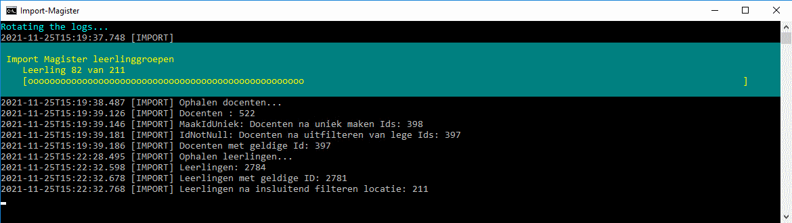
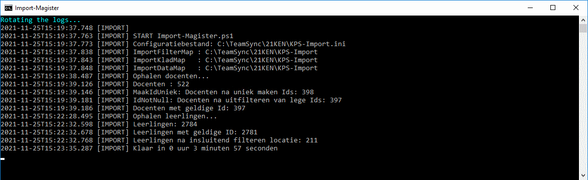
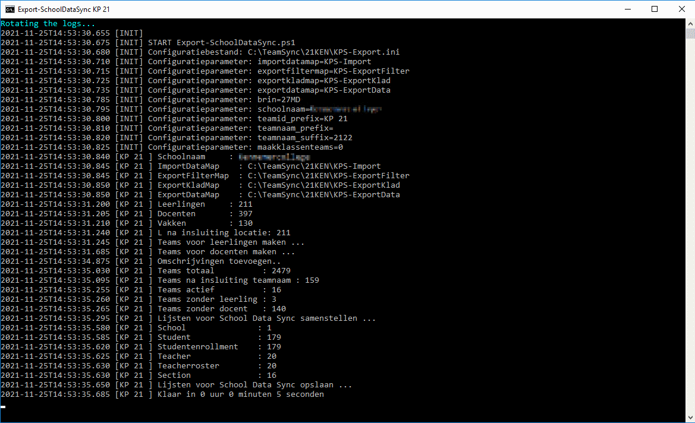

= TeamSync versie 20211019

Paul Wiegmans <p.wiegmans@svok.nl>

:idprefix:
:idseparator: -
:sectanchors:
:sectlinks:
:sectnumlevels: 4
:sectnums:
:toc:
:toclevels: 4
:toc-title:

TeamSync is een universele oplossing voor het overbrengen van gegevens uit Magister naar School Data Sync ten behoeve van een geautomatiseerde aanmaak van Teams in een Microsoft 365 omgeving. 

Deze oplossing maakt gebruik van https://sds.microsoft.com/[Microsoft School Data Sync]. School Data Sync is een oplossing die identiteiten vanuit een schooladministratiesysteem synchroniseert met Microsoft 365, en klassenteams maakt voor alle actieve klassen of lesgroepen.

Inspiratie hiervoor komt uit eerder werk genaamd 'v06-sds-files_FONSVITAE.ps1' door Wim den Ronde, Eric Redegeld, Joppe van Daalen.

Gebruikt jouw school Somtoday en zoek je een koppeling tussen Somtoday en School Data Sync ? Bezoek dan https://github.com/DwayneSelsig/Somtoday2MicrosoftSchoolDataSync[GitHub: DwayneSelsig/Somtoday2MicrosoftSchoolDataSync]

toc::[]

== Beknopte installatie

Om TeamSync in te zetten is het volgende nodig.  

* Een computer met Windows PowerShell versie 5, welk ip-adres is opgenomen in de lijst met ip-adressen die zijn toegestaan om te verbinden met Magister SOAP API, ook bekend als webqueries.
* link:Import-Magister.ps1[Import-Magister.ps1], 
* link:Export-SchoolDataSync.ps1[Export-SchoolDataSync.ps1],
* link:Teamsync.cmd[Teamsync.cmd],
* Een configuratiebestand zoals bijvoorbeeld link:Import-Magister-voorbeeld.ini[Import-Magister-voorbeeld.ini],
* een configuratiebestand zoals bijvoorbeeld link:Export-SchoolDataSync-voorbeeld.ini[Export-SchoolDataSync-voorbeeld.ini],
* Een URL naar de Magister webservice; een gebruikersnaam en een wachtwoord met toegangsrechten tot de AD-functies van de Magister SOAP API.
* Start Teamsync met het commando link:Teamsync.cmd[Teamsync.cmd].
* Maak een scheduled task om TeamSync dagelijks uit te voeren.
* Richt https://sds.microsoft.com/[Microsoft School Data Sync] in en creëer een synchronisatieprofiel voor de gewenste school. 
* Upload dagelijks de door TeamSync aangemaakte CSV-bestanden naar het synchronisatieprofiel om de Microsoft 365 klassenteams bijgewerkt te houden met de actuele leerlingen, docenten en lesgroepen. 

== Werking 

TeamSync leest uit Magister lijsten met leerlingen, docenten, klassen, lesgroepen en vakken.,
TeamSync genereert hieruit lijsten waarin voor elk samenwerkingsverband bestaande uit lesgroep of combinatie van klas en vak, waarvan zowel leerlingen als docent(en) lid zijn, een actief team in de uitvoer terechtkomt. Deze lijsten vormen de basis voor een actieve synchronisatie van https://sds.microsoft.com/[Microsoft School Data Sync]. SDS maakt de juiste Microsoft 365 klassenteams aan, maakt de juiste docent teameigenaar en voegt de juiste leerlingen als leden toe.

TeamSync bestaat uit twee scripts: 

* `Import-Magister.ps1`
* `Export-SchoolDataSync.ps1`

Script `Import-Magister.ps1` wordt eerst uitgevoerd om gegevens uit Magister op te halen. Daarna wordt script `Export-SchoolDataSync.ps1` uitgevoerd om de bestanden te genereren. De uitvoer bestaat uit 6 CSV-bestanden die nodig zijn voor synchronisatie met een profiel in https://sds.microsoft.com/[Microsoft School Data Sync].

Voor het ophalen van gegevens wordt gebruik gemaakt van de Magister SOAP/XML Webservice. Er is hiervoor een geldige gebruikersnaam en een wachtwoord vereist en permissies voor het uitvoeren van webqueries en dan specifiek de AD-functies. Er wordt gebruik gemaakt van de standaard Web API van Magister. Er zijn geen zogenaamde aangepaste lijsten of 'custom queries' nodig. Je kunt meer lezen hierover op https://sikkepitje.nl/Tech/MagisterSOAP2020[Magister SOAP/XML webservice]. 

=== Identiteiten koppelen

Voor het genereren van de juiste gegevens voor School Data Sync moeten de identiteiten van docenten en leerlingen in Magister worden gepaard (gekoppeld, "match") aan de overeenkomstige identiteiten van alle gebruikers in Microsoft 365 en Teams, dus in Azure Active Directory (AAD). In de uitvoer die TeamSync genereert, wijst ID naar de unieke identiteit van een medewerker of gebruiker in AAD. De ID kan een suffix bevatten, maar dat hoeft niet. Indien nodig wordt door School Data Sync aan dit veld de suffix toegevoegd om te refereren aan een unieke gebruiker in AAD. 

Voor leerlingen kan makkelijker het Magister email gebruikt om de unieke ID te bepalen. Voor medewerkers is dit lastiger omdat in Magister geen e-mailadres is opgeslagen op een manier die TeamSync kan uitlezen. 

IMPORTANT: Hier wordt ervan uitgegaan dat alle gebruikersaccounts al in AAD aanwezig zijn en dus niet door School Data Sync actief worden aangemaakt.

De volgende methoden van koppeling worden ondersteund voor medewerkers:

* ID <- Magister:code
* ID <- Magister:loginaccount
* ID <- CSV[Magister:stamnr]

De volgende methoden van koppeling worden ondersteund voor leerlingen:

* ID <- Magister:email
* ID <- Magister:loginaccount

In het configuratiebestand moet één koppelmethode voor leerlingen en één koppelmethode voor medewerkers worden gedefinieerd. 

IMPORTANT: TeamSync vanaf versie 20201127 ondersteunt niet meer het opzoeken van de UserPrincipalName in active Directory (via INI-parameters `useemail`, `ADsearchscope`, `ADserver`). Het alternatief hiervoor is om een CSV-opzoektabel te gebruiken. Je kunt deze CSV-tabel aanmaken met behulp van een script die de informatie leest uit Active Directory of uit een andere bron. Een voorbeeld van een script die de CSV-tabel vult met informatie uit Active Directory vind je in link:Ophalen-ADMedewerkerUPN.ps1[Ophalen-ADMedewerkerUPN.ps1].

De gewenste koppelmethode wordt aangeduid met één van de volgende variabelen. 

** `medewerker_id=loginaccount` : Koppel Id aan Magister loginaccount. Id bevat geen domeinsuffix. SDS vult Id aan met een domeinsuffix. 

** `medewerker_id=code` : Koppel Id aan Magister code. Id bevat geen domeinsuffix. School Data Sync (SDS) vult Id aan met een domeinsuffix.

** `medewerker_id=csv_upn` : Koppel Id aan UserPrincipalName van de gebruiker in een extern CSV-bestand waarvan employeeId overeenkomt met Magister stamnummer. Zie sectie Medewerker-UPN-CSV voor een beschrijving van dit bestand. Id bevat de domeinsuffix.

** `leerling_id=loginaccount` : koppel Id aan Magister loginaccount. Id bevat geen domeinsuffix. SDS vult Id aan met een domeinsuffix.

** `leerling_id=email` : Koppel ID aan Magister email. Id bevat een domeinsuffix. De leerlingen worden uniek geidentificeerd met het "email" veld in de Magister leerlingkaart. Het is de verantwoordelijkheid van de school om ervoor te zorgen dat het email-veld van leerlingen is ingevuld met de overeenkomstige userPrincipalName van de leerling in Azure AD / Microsoft 365. 

== Bestanden en mappen

=== Configuratiebestand
Dit bestand heet bij verstek `Import-Magister.ini` voor het importscript of `Export-SchoolDataSync.ps1` voor het exportscript en staat in dezelfde map als het script. Het bevat configuratievariabelen die de werking van TeamSync beinvloeden. Een andere bestandsnaam kan worden aangegeven door middel van de  <<Parameter Inifile>>. Configuratievariabelen worden behandeld in hoofdstuk <<Configuratie>>.

=== Importfiltermap
In deze map worden <<Filters>> geplaatst ten behoeve van het importscript.

=== Importkladmap
Het importscript plaatst hier tijdelijke bestanden, die slechts dienen om de goede werking te controleren van de Magister webservice en instellingen en filters van TeamSync,

=== Importdatamap
Het importscript plaatst in deze map een aantal bestanden met uit Magister opgehaalde gegevens over leerlingen, docenten en vakken. Het exportscript heeft deze bestanden nodig om in te lezen en bewerkt ze verder. 

* `magister_leer.clixml`
* `magister_docent.clixml`
* `magister_vak.clixml`

Bestanden met de extensie ".clixml" zijn bestanden  in een XML-formaat die door PowerShell kunnen worden weergegeven met het volgende commando:
[source,powershell]
----
Import-CliXML -Path $clixmlfile | Out-GridView -Wait
----

=== Exportfiltermap
In deze map worden <<Filters>> geplaatst ten behoeve van het exportscript.

=== Exportkladmap
Het exportscript plaatst hier tijdelijke bestanden, die dienen om de goede werking te controleren van TeamSync, met name instelingen en filters.

=== Exportdatamap
Het exportscript maakt in deze map volgens de specificaties van School Data Sync de volgende bestanden aan. 

* `School.csv`
* `Section.csv`
* `Student.csv`
* `StudentEnrollment.csv`
* `Teacher.csv`
* `TeacherRoster.csv`

Deze bestanden zijn bedoeld om te uploaden naar het gewenste synchronisatieprofiel in School Data Sync. 

=== Medewerker_UPN.CSV
Dit wordt ingelezen door importscript uit de importfiltermap. Indien de koppelmethode gebruik maakt van een CSV-bestand (configuratieparameter "medewerker_id=csv_upn"), dan moet in de Importfiltermap een CSV-bestand worden aangeleverd worden. 
De naam van dit bestand is `Medewerker_UPN.csv`. De inhoud van dit bestand bestaat uit een kopregel en één of meer gegevensregels. De kopregel bevat "employeeId,UserPrincipalName". Voor elke medewerker in Magister is er een gegevensregel. De gegevensregels bevatten elk twee gegevensvelden, gescheiden door een komma. Het eerste gegevensveld bevat het stamnummer van een medewerker. Het tweede gegevensveld bevat de overeenkomstige UserPrincipalName die de gebruiker in Microsoft 365 uniek identificeert. De velden mogen omsloten zijn door dubbele aanhalingstekens, maar dat is niet verplicht.

=== Filters
In zowel de Importfiltermap als de Exportfiltermap kunnen één of meer bestanden worden geplaatst om filters toe te passen op de te verwerken gegevens. Hierbij wordt gebruikt gemaakt van zogenaamde 'regular expressions' oftewel regex-patronen. Met behulp van de regex-patronen kunnen krachtige selecties worden gemaakt die bepalen welke gegevens moeten worden verwerkt en welke niet. De filters kunnen worden toegepast om de hoeveelheid te verwerken gegevens te reduceren en slimme selecties te maken op welke gegevens resulteren in actieve klassenteams. 

Er kan bij het ophalen van Magistergegevens door `Import-Magister.ps1` worden gefilterd op: 

* docent(id), 
* klas, 
* studie, 
* locatie (overeenkomend met Administratieve_eenheid.Omschrijving in Magister).

Er kan bij het bepalen van klassenteams door `Export-Magister.ps1` worden gefilterd op:

* docent(id),
* klas, 
* studie, 
* locatie (overeenkomend met Administratieve_eenheid.Omschrijving in Magister),
* teamnaam.

Er zijn twee typen filters te definieren: 

* _insluitende_ of _inclusieve_ filters, en
* _uitsluitende_ of _exclusieve_ filters. 

Bij insluitende filters worden alleen de gegevens die overeenkomen met de opgegeven regex-patronen verwerkt en de rest wordt weggegooid. 
Bij uitsluitende filters worden alle gegevens die **niet** overeenkomen met de opgegeven patronen verwerkt, terwijl de gegevens die wel overeenkomen niet worden verwerkt.
Je kunt insluitende en uitsluitende filters combineren om te komen tot een nauwkeurige gedefinieerde verzameling klassenteams, die precies beantwoordt aan de behoefte.


De volgende filterbestanden kunnen worden gedefinieerd door het overeenkomstige bestand in de Importfiltermap en/of Exportfiltermap te definieren en deze te vullen met de gewenste regex-patronen. 

* `excl_docent.csv` : dit bevat filters voor het uitsluitend filteren van docenten op Id.
* `incl_docent.csv` : filters voor het insluitend filteren van docenten op Id.
* `excl_klas.csv` : filters voor het uitsluitend filteren van leerlingen op klasnaam.
* `incl_klas.csv` : filters voor het insluitend filteren van leerlingen op klasnaam.
* `excl_studie.csv` : filters voor het uitsluitend filteren van leerlingen op studie.
* `incl_studie.csv` : filters voor het insluitend filteren van leerlingen op studie.
* `incl_locatie.csv` : filters voor het insluitend filteren van leerlingen op locatie oftewel Magister:Administratieve_eenheid.Omschrijving.
* `incl_teamnaam.csv` : (alleen in de ExportFiltermap t.b.v. `Export-SchoolDataSync.ps1`) filters voor het insluitend filteren van teams op (weergave)naam. t.b.v. `Export-SchoolDataSync.ps1`
* `excl_teamnaam.csv` : (alleen in de ExportFiltermap t.b.v. `Export-SchoolDataSync.ps1`) filters voor het uitsluitend filteren van teams op (weergave)naam.

Het gebruik van deze filterbestanden is optioneel. Als ze bestaan, worden ze ingelezen en gebruikt. Als ze niet bestaan, wordt er niet gefilterd. Indien gebruikt, dan bevat elk filterbestand één of meer regex-patronen, elk op een eigen regel, die worden toegepast voor het filteren van de relevante gegevens. Elke regex-patroon matcht een deel van de invoer. Wildcards zijn niet nodig. Alle tekens met een speciale betekenis voor de match-operator zijn hierbij toegelaten. Plaats geen lege regels in het filterbestand.

Speciale betekenis hebben:

* `^` matcht het begin van een zoekterm 
* `$` matcht het eind van een zoekterm
* '\' is een escape-teken voor tekens die een speciale betekenis voor regex hebben.
* '\s' is een aanduiding voor een spatie.

Voor een uitgebreidere uitleg over regular expressions of regex, zie https://nl.wikipedia.org/wiki/Reguliere_expressie[Reguliere expressie - Wikipedia]

==== Voorbeelden van filters
===== Filtervoorbeeld VAVO uitfilteren
Alle leerlingen waarvan de studie eindigt op "VAVO" worden uitgesloten.

Het bestand `ImportFilterMap\excl_studie.csv` wordt aangemaakt en bevat: 
```
VAVO$
```
===== Filtervoorbeeld Brugklassen, Mavo, Havo, Vwo
We willen de leerlingen van Mavo, Havo, Vwo en de brugklassen verwerken; alle leerlingen in een studie die begint met B,M,H of V moeten worden verwerkt. 

Het bestand `ImportFilterMap\incl_studie.csv` wordt aangemaakt en bevat:
```
^M
^H
^V
^B
```
===== Filtervoorbeeld: H4 en H5
Voorbeeld : we willen alleen 4 en 5 Havo en verwerken; alle leerlingen in de klas die begint met '4H' of '5H' moeten worden verwerkt. 

Het bestand `ImportFilterMap\incl_klas.csv` bevat:
```
^5H
^4H
```

===== Filtervoorbeeld: Geen tweede rol in Magister
Voorbeeld: we willen alleen docenten wiens id niet begint met '_' of eindigt op '*'. 

Het bestand `ImportFilterMap\excl_docent.csv` bevat:
```
^_
\*$
```

===== Filtervoorbeeld: 1 Magister, 4 scholen
Voorbeeld: In het geval dat er 4 scholen gebruik maken van 1 Magisterinstantie, en alleen klassenteams voor Beroepsgericht zijn gewenst. Alle docenten, leerlingen en lesgroepen hebben Magister:Administratieve_eenheid.Omschrijving = "Beroepsgericht".

Het bestand `ImportFiltermap\incl_locatie.csv` *of* `ExportFiltermap\incl_locatie.csv` bevat: 
```
Beroepsgericht
```

===== Filtervoorbeeld: Alleen teams met " EN "
Voorbeeld: alleen teams met " EN " in de naam. 

Het bestand `Export-Filter\incl_teamnaam.csv` bevat: 
```
\sEN\s
```
Gotcha: het filter is niet hoofdlettergevoelig, dus filtert ook alle voorkomingen van " en ".

== Configuratie

Het configuratiebestand definieert een aantal parameters (anders gezegd: configuratievariabelen), die nodig zijn voor de correct werking van TeamSync.

De parameters in het configuratiebestand worden gespecificeerd als een naam-waarde-paar en hebben de volgende vorm:

```
<naam>=<waarde>
```

Aanhalingstekens zijn toegestaan maar niet nodig. Spaties in het waarde-deel zijn toegestaan. Commentaarregels zijn toegestaan, door de regel te beginnen met '#'.

IMPORTANT:  Backslashes worden opgevat als escape-karakters. Om backslashes in paden op te geven, escape deze met een extra backslash. Bijvoorbeeld: `Importfiltermap=Submap1\\Submap2\\Submap3`

=== Configuratievariabelen voor importscript
De volgende parameters kunnen worden gedefinieerd in het configuratiebestand van het importscript.

[square]
* `Importfiltermap=waarde` : pad naar invoermap relatief t.o.v. scriptpad
* `Importkladmap=waarde` : pad naar kladmap relatief t.o.v. scriptpad
* `Importdatamap=waarde` : pad naar uitvoermap relatief t.o.v. scriptpad
* `magisterUser=waarde` : webservice-gebruikersnaam
* `magisterPassword=waarde` : webservice-wachtwoord
* `magisterUrl=waarde` : webservice-URL
* `handhaafJPTMedewerkerCodeIsLogin=waarde` : filtert dubbele identiteiten weg voor Code<>Login
* `medewerker_id=waarde` : koppelmethode voor medewerkers
* `leerling_id=waarde` : koppelmethode voor leerlingen

=== Configuratievariabelen voor exportscript
De volgende parameters kunnen worden gedefinieerd in het configuratiebestand van het exportscript.

* `Importdatamap=waarde` : pad naar importdatamap relatief t.o.v. scriptpad
* `Exportfiltermap=waarde` : pad naar exportfiltermap relatief t.o.v. scriptpad
* `Exportkladmap=waarde` : pad naar exportkladmap relatief t.o.v. scriptpad
* `Exportdatamap=waarde` : pad naar exportdatamap relatief t.o.v. scriptpad
* `brin=waarde` : BRIN-nummer van de school
* `schoolnaam=waarde` : naam van de school in SDS
* `teamid_prefix=waarde` : prefix voor team-ids in SDS
* `teamnaam_prefix=waarde` : prefix voor teamnamen in SDS
* `teamnaam_suffix=waarde` : suffix voor teamnamen in SDS
* `maakklassenteams=waarde` : schakelaar voor aanmaken van een team voor iedere (stam)klas
* `bon_match_docentlesgroep_aan_leerlingklas=waarde`  : schakelaar voor matchen aan tweede deel van docent-groepvaknaam
* `docenten_per_team_limiet=waarde` : bepaalt limiet van het aantal docenten per tema.

==== Brin
Deze parameter is verplicht. Dit is het BRIN-nummer van de school. Vraag je schooladminstratie of directie hiervoor. 

==== Schoolnaam 
Deze parameter is verplicht. Dit is de schoolnaam zoals die in School Data Sync moet zijn gedefinieerd. 

==== MagisterUser, MagisterPassword, MagisterUrl 
Deze parameters zijn verplicht. Deze gegevens zijn vereist om toegang te krijgen tot de Medius Webservices. De LAS-beheerder maakt een gebruiker aan in de Webservice gebruikerslijst in Magister. De gebruikersnaam en wachtwoord moeten worden gegeven in `MagisterUser` en `MagisterPassword`. Deze gebruiker heeft toegangsrechten nodig tot de *_ADfuncties_* in de Medius Webservices. De MagisterUrl is de URL waar de webservices worden aangeboden. Dit bestaat uit de schoolspecifieke URL voor  Schoolwerkplek met daarachter poort en padaanduiding _:8800/doc_ . De hele URL ziet er uit als `https://schooldomein.swp.nl:8800/doc`.

==== Teamid_prefix
Deze parameter is verplicht. Deze tekst wordt toegevoegd aan het begin van de ID van team. Dit wordt deel van de unieke ID die elk team uniek identificeert in Microsoft 365. Een nuttige prefix identificeert zowel de school als het schooljaar en is bijvoorbeeld "JPT 1920". Spaties in de naam worden omgezet in underscores ten behoeve van het bepalen van de ObjectID. 

==== Teamnaam_prefix
Deze tekst wordt toegevoegd aan het begin van de weergavenaam van elk team en wordt zichtbaar in de teamlijst van alle deelnemers.

==== Teamnaam_suffix
Deze tekst wordt toegevoegd aan het eind van de weergavenaam van elk team en wordt zichtbaar in de teamlijst van alle deelnemers.

==== Importfiltermap
Dit specifieert de naam van de Importfiltermap, relatief ten opzichte van de locatie van het script. Bij verstek is de naam `ImportFilter`. 

==== Importkladmap
Dit specificeert de mapnaam van de Importkladmap relatief ten opzichte van de locatie van het script. Bij verstek is de naam `ImportKlad`.

==== Importdatamap
Dit specificeert de mapnaam van de Importdatamap relatief ten opzichte van de locatie van het script. Bij verstek is de naam `ImportData`.

==== Exportfiltermap
Dit specifieert de naam van de Importfiltermap, relatief ten opzichte van de locatie van het script. Bij verstek is de naam `ExportFilter`. 

==== Exportkladmap
Dit specificeert de mapnaam van de Importkladmap relatief ten opzichte van de locatie van het script. Bij verstek is de naam `ExportKlad`.

==== Exportdatamap
Dit specificeert de mapnaam van de Importdatamap relatief ten opzichte van de locatie van het script. Bij verstek is de naam `ExportData`.

==== handhaafJPTMedewerkerCodeIsLogin 
Gebruik `handhaafJPTMedewerkerCodeIsLogin=1`. Bij verstek geldt `handhaafJPTMedewerkerCodeIsLogin=0` . Deze instelling dient om uitsluitend medewerkers te verwerken waarbij Magister->Code gelijk is aan Magister->loginaccount.naam. Dit filter wordt in een speciaal geval voor JPT toegepast om dubbele identiteiten weg te filteren. 

==== medewerker_id
Deze parameter duidt aan hoe identiteiten van medewerkers in Azure AD worden gekoppeld aan Magister. Deze parameter is verplicht. Toegestane waarden zijn 
`code`, `loginaccount`, `ad_upn`, `csv_upn`
. Zie <<Identiteiten koppelen>> . 

==== leerling_id
Deze parameter duidt aan hoe identiteiten van leerlingen in Azure AD worden gekoppeld aan Magister. Deze parameter is verplicht. Toegestane waarden zijn 
`loginaccount`, `email`
. Zie <<Identiteiten koppelen>> . 

=== bon_match_docentlesgroep_aan_leerlingklas
Deze parameter is een schakelaar die uit staat met `0` of aan staat met de waarde `1`. Wanneer `1` dan worden extra teams aangemaakt, waarvan de naam wordt opgebouwd uit het deel van de klasnaam na de punt in de docent-groepvakken, gevolgd door een vaknaam. Bij verstek is de waarde `0`. Deze parameter zorgt ervoor dat het aantal actieve teams in de onderbouw van Bonhoeffercollege wordt verhoogd met teams voor docentgroepvakken voor lesgroepen met namen als "B.B2" en "M2.M2a", waarvan alleen het deel achter de punt wordt gebruikt om te kunnen koppelen aan leerlingklassen. 

=== docenten_per_team_limiet
Deze parameter bevat een getal dat wordt vergeleken met het aantal docenten in elke kandidaatteam. Indien het aantal docenten hoger is dan gegeven door deze parameter, dan wordt het team overgeslagen bij het identificeren van actieve teams. Wanneer deze parameter `0` is, dan wordt deze controle op het aantal docenten niet uitgevoerd. Bij verstek is de waarde `0`.


== Commandoregelparameters

=== Parameter Inifile 
Met de commandoregelparameter `-Inifile` wordt de naam van een alternatief <<Configuratie>>-bestand opgegeven. De naam is geinterpreteerd als relatief ten opzichte van de map waarin het script staat. Deze voorziening maakt het mogelijk om gegevens van verscheidene instanties van Magister gescheiden te verwerken. 

Een voorbeeld : 

 <scriptnaam> -Inifile <bestandsnaam> 

waarbij `<bestandsnaam>` de naam is van een configuratiebestand. Deze parameter heeft de aliassen `Inifilename`,`Inibestandsnaam`,`Config`,`Configfile` en `Configuratiebestand`. Een alternatief configuratiebestand kan dus ook worden opgegeven met bijvoorbeeld: 

 <scriptnaam> -Config <bestandsnaam> 

==== Voorbeeld
Met het volgende CMD commandoscript kan het configuratiebestand 'Team-JPT.ini' worden gebruikt om script 1 en 2 uit te voeren, wanneer deze in dezelfde map als dit commandoscript staan. 

```
@echo off
Powershell.exe -NoProfile -NoLogo -ExecutionPolicy Bypass -File "%~dp0Import-Magister.ps1" -Inifile "Team-JPT.ini"
Powershell.exe -NoProfile -NoLogo -ExecutionPolicy Bypass -File "%~dp0Export-SchoolDataSync.ps1" -IniFile "Team-JPT.ini"
```

== Tips en trucs

=== Run de scripts

Vanaf de PowerShell prompt gebruikmaken van verstekwaarden:
```
. .\Import-Magister.ps1
. .\Export-SchoolDataSync.ps1
```
Vanaf PowerShell prompt met parameters:
```
. .\Import-Magister.ps1 -IniFile Magister.ini
. .\Export-SchoolDataSync.ps1 -IniFile School1.ini
. .\Export-SchoolDataSync.ps1 -IniFile School2.ini
```

Vanaf de CMD prompt of door middel van een batchbestand:
```
@PowerShell.exe -NoProfile -NoLogo -ExecutionPolicy Bypass -File "%~dp0Import-Magister.ps1" -IniFile Magister.ini
@PowerShell.exe -NoProfile -NoLogo -ExecutionPolicy Bypass -File "%~dp0Export-SchoolDataSync.ps1" -IniFile School1.ini
@PowerShell.exe -NoProfile -NoLogo -ExecutionPolicy Bypass -File "%~dp0Export-SchoolDataSync.ps1" -IniFile School2.ini
```

=== Logbestanden

De twee scripts loggen alle schermuitvoer en foutmeldingen in een logbestand, met de naam "Import-Magister.log" respectievelijke "Export-SchoolDataSync.log" in de map "Log" in de map waar de scriptbestanden staan. Bestudeer deze logs om te onderzoeken welke foutmeldingen zijn gegenereerd, en op welke regel dat gebeurde.

De logbestanden worden geroteerd elke keer dat een script wordt uitgevoerd. Bij elke keer dat het importscript en exportscript worden uitgevoerd, worden de laatste 7 logbestanden hernoemd en een nieuw logbestand wordt aangemaakt. Het oudste logbestand wordt verwijderd. De naam van de bewaarde logbestanden zijn "Import-Magister.01.log" respectievelijk "Export-SchoolDataSync.01.log" en deze zijn opeenvolgend genummerd naarmate het logbestand ouder is. Er worden van elke script altijd ten hoogste 8 logbestanden bewaard.

=== Controle van uitvoer

TeamSync maakt een aantal bestanden aan, die inzicht geven in welke teams door School Data Sync aangemaakt zouden worden en welke gegevens worden verwerkt. Deze bestanden hebben een CSV-formaat (Comma Separated Values). Dit is een belangrijke hulp bij het bepalen van de juiste filters en instellingen. 

Script Import-Magister genereert onder andere: 

* `leerling.csv` : Een lijst met leerlingen zoals die uit Magister wordt gelezen.
* `docent.csv` : Een lijst met medewerkers zoals die uit Magister wordt gelezen.

Script Export-SchoolDataSync genereert onder andere:

* `hteamactief_{teamid_prefix}.csv` : Een lijst met alle teams die TeamSync als actief aanmerkt. Dit zijn de teams die in de uitvoer voor SDS voorkomen.
* `hteam0doc_{teamid_prefix}.csv` : Een lijst met Teams die als inactief zijn aangeduid omdat een docent hierin ontbreekt.
* `hteam0ll_{teamid_prefix}.csv` : Een lijst met Teams die als inactief zijn aangeduid omdat leerlingen hierin ontbreken.

Om te zien welke teams actief zouden worden gesynchroniseerd door Microsoft School Data Sync, open het bestand met de naam `hteamactief_{teamid_prefix}.csv`.

=== Typische gebruikscenarios

==== Testen

Gedurende het testen is het meest  handig als `Import-Magister.ps1` gedurende een run zonder filters wordt uitgevoerd om alle gegevens op te halen uit Magister. Wanneer dit eenmaal is gebeurd, dan kan `Export-SchoolDataSync.ps1` herhaaldelijk met één of meer filters worden uitgevoerd om te kijken wat het resultaat zou worden. Dit laatste script wordt veel sneller uitgevoerd, omdat het niet steeds opnieuw de gegevens uit Magister hoeft op te halen. 

==== Een Magister, twee scholen  (UITWERKEN)

Een scenario van het soort 'Één Magister - twee scholen' kan er zo uitzien: 

* Het script `Import-Magister.ps1` wordt uitgevoerd met een aangepast configuratiebestand, zonder filters, dat alle gegevens worden opgehaald uit Magister. Dit levert snelheidswinst op. De tussenresultaten worden opgeslagen in de Importdatamap. 
* Het script `Export-SchoolDataSync.ps1` wordt één keer uitgevoerd voor elke school met een voor één school specifiek configuratiebestand: 
** Importdatamap, Exportfiltermap, Exportdatamap verwijzen naar een school-specifieke map 
** de schoolspecifieke Exportfiltermap bevat in het bestand `incl_locatie.csv` een of meer school-specifieke regexpatronen die overeenkomen met de gewenste waarden voor het veld Administratieve_eenheid.Omschrijving in Magister. 
** `teamid_prefix` enz. verschilt per school.

Dit scenario wordt gecomplementeerd met een eigen synchronisatieprofiel voor elke school in School Data Sync. De uitvoerbestanden worden geupload naar het respectievelijke synchronisatieprofiel.

=== LET OP: Leerlingen, docenten en vakken moeten actief zijn in Magister

Probeer je TeamSync uit, maar krijg je geen actieve teams? Waarschijnlijk haal je de Magistergegevens op in de zomervakantie. 
Dat gaat niet werken en waarom wordt hieronder uitgelegd. 

Om een lijst met actieve teams te genereren, moeten de gegevens in Magister aan een aantal strikte voorwaarden voldoen:

* Leerlingen en docenten moeten actief zijn, d.w.z. de inschrijfdatum moet in het verleden liggen, en de uitschrijfdatum in de toekomst of leeg.
* Leerlingen en docenten moeten een ingevulde locatie oftewel "Administratieve_eenheid.Omschrijving" hebben.
* Leerlingen moeten lid zijn van een klas.
* Er moet een docent zijn toegewezen aan elk vak (in de lessentabel van een leerling). 
* De lesperiode, waarin elk vak wordt gegeven door de docent aan de klas, moet actief zijn, d.w.z. de huidige datum moet tussen begindatum en einddatum liggen.

Als aan de bovenstaande voorwaarden niet is voldaan, worden de verbanden tussen docenten, leerlingen (lesgroep) en vak niet als actief beschouwd en bevat de uitvoer geen actieve teams.
Vanwege deze reden zal TeamSync in de zomervakantie geen nuttige uitvoer leveren. 

=== Bekende tekortkomingen

==== Vakomschrijving in teamnaam wijkt af

Voor elk team dat TeamSync samenstelt uit een lesgroep, plaatst het een vakomschrijving in de weergavenaam van het team. De vakomschrijving wordt bepaald door een vakcode te distilleren uit de lesgroepnaam. Het kijkt naar de tekens achter een punt of komma, met weglating van alle cijfers. De overblijvende tekenreeks wordt achtereenvolgens kleiner gemaakt totdat er een overeenkomstige vakcode gevonden wordt in de vakkentabel. De daarbij horende vakomschrijving wordt in de teamnaam geplaatst. Wanneer de vakcode niet eenduidig kan worden bepaald, kan het gebeuren dat een verkeerde vakomschrijving in de teamnaam geplaatst. 

De makkelijkste manier om dit te verhelpen is om door te gaan met de implementatie van TeamSync en School Data Sync. Wanneer de teams met een verkeerde vakomschrijving in de weergavenaam zijn aangemaakt, wijzig de naam van de teams met de hand. Iedereen kan dit doen voor elk team waarvan iemand eigenaar is of een beheerder kan dit doen voor alle teams in de Teams Admin Center.

Een minder makkelijke workaround wanneer de teams nog niet zijn aangemaakt, is na uitvoeren van het importscript en vóór het uitvoeren van het exportscript om de vakkentabel `magister_vak.clixml` aan te passen, en een vakomschrijving te geven voor een afwijkende vakcode. Dit is dan alleen nodig voor de initiele synchronisatie van School Data Sync, en kies daarbij de instellingen "Section display names are synced only on first sync" . Wanneer de teams eenmaal zijn aangemaakt, wijzigt de naam niet meer.

=== CSV synchronisatie automatiseren

Om ten volle gebruik te maken van dagelijks bijgewerkte Microsoft 365 klassenteams, is het  aanbevolen om de door TeamSync aangemaakte CSV-bestanden dagelijks naar Microsoft School Data Sync te uploaden. Om dit op een betrouwbare manier te automatiseren kun je gebruik maken van Microsoft Power Automate en de https://powerautomate.microsoft.com/nl-NL/connectors/details/shared_microsoftschooldatasync/microsoft-school-data-sync/[SDS Flow Connector]. Lees meer over de inrichting en vereisten op https://docs.microsoft.com/en-us/schooldatasync/csv-file-sync-automation[CSV File Sync Automation].

== Schermafdrukken

=== Import-Magister



=== Export-SchoolDataSync


== Handige links

* https://sds.microsoft.com/[Microsoft School Data Sync]
* https://github.com/DwayneSelsig/Somtoday2MicrosoftSchoolDataSync[DwayneSelsig/Somtoday2MicrosoftSchoolDataSync]
